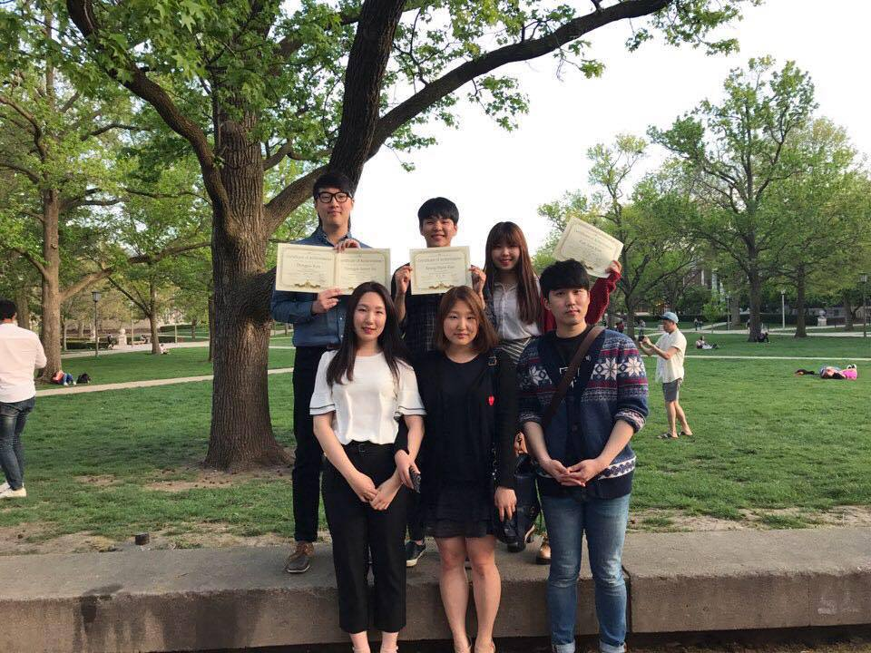

<h1>Kylie's Website</h1>
<p1>This is Kylie's personal Website. You are welcomed to look around and explore!</p1>

 
<h3>About Me</h3>
<ul>
  <li>Sophmore</li>
  <li>Major in Statistics</li>
  <li>Come from South Korea</li>
  <li>Email: eunjung2@illinois.edu</li>
  <li> <a href="https://www.facebook.com/kim.eunjung.9400">Facebook account</a></li>
</ul>

<h3>Experience</h3>

<p2>a member of KSA</p2>
<p1>KSA, Korean Student Association, is a RSO of University of Illinois that designs the events and provides job information for Korean students in UIUC. I have been a member of this RSO for two years. For freshman years, I was in finanacial team who managed and recorded all of the financial acitivies in KSA. In sophmore year, I'm now in corporate relations team that </p1>
